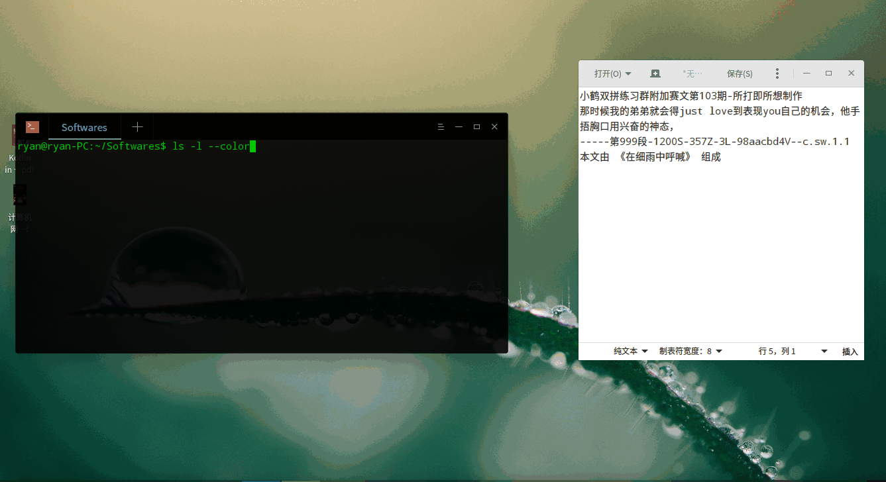

### 1. 说明
一个跨平台跟打器，使用了 java10 + javafx + spring 实现.
现在刚刚做到可用的程度, 名字也还没取。。

### 2. 使用方式
1. 项目使用了 java10 的 var 关键字, 所以运行前提是你安装了 [jre10](http://www.oracle.com/technetwork/java/javase/downloads/jre10-downloads-4417026.html). 如果没有安装, 请先安装该环境.
2. 下载[最新的jar包](https://github.com/yuansuye/TypingPractice/releases).
3. 在jar包所在目录下, 运行 `java -jar typing_practice.x.x.x.jar`, `x.x.x` 请换成你下载的版本.

### 3. 演示：

### 4. TODO list

#### 属性

- [x] 速度/击键/码长
- [x] 用时/字数/键数
- [x] 回车/退格
- [x] 错字
- [x] 打词
- [ ] 键准
- [ ] 重打

#### 功能

- [x] 剪切版载文
- [x] 离开窗口时,暂停记录
- [x] 跟打窗口实时显示跟打状态
- [ ] 打开载文面板
- [ ] 模式切换
- [ ] 帮助

#### 已知 Bug

- [ ] 嵌入模式下, 跟打状态更新异常.(多多输入法在非嵌入模式下也会嵌入一个空格, 所以也是同一个bug)
	- 需要找到一个检测字符是否已经上屏的方法, 只在已经上屏时, 才调用 updateText() 方法.
- [ ] 只有从跟打框的尾部输入时, 跟打状态、错字统计才能正常更新. 
	- 检测到光标不在末尾时, 每次刷新整个跟打状态区的状态.
- [ ] 窗口组件的高度不能自适应.(宽度是自适应的)
	- 没想好怎么弄, 叫人来写css?
- [ ] deepin 下字体很丑
	- 安装一个宋体?
- [ ] 空格不能变色？这样跟打到空格会很困惑这个空格到底是打了还是没打
    - javafx 的 Text 对象好像没有 background 类，不知道该怎么弄。